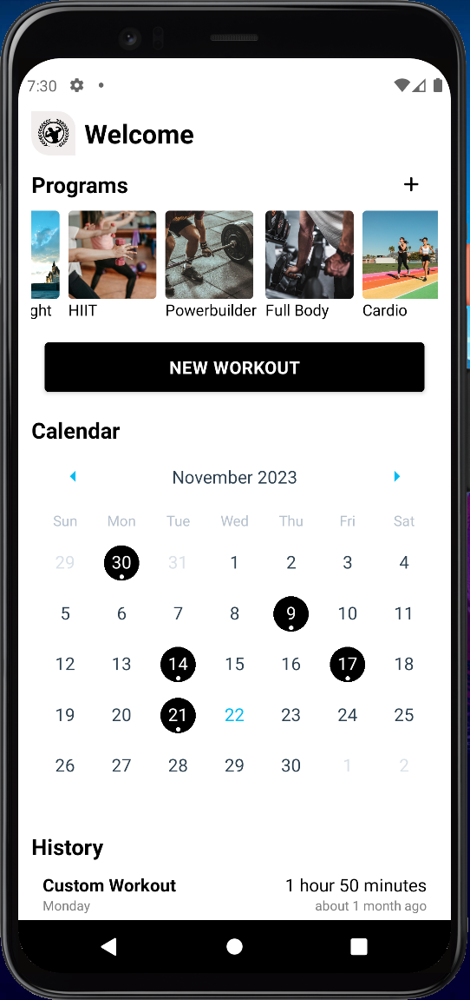

# Strive
Workout tracker in your pocket



## Instructions
Clone the repo, install dependencies and run the next command in your terminal:
```
npx expo start
```
Then, you should be able to start the app in the device of your preference.

## Preview
While the app is still in development, you can test its current features. Please note that some features may be under construction or not fully implemented yet.

## Stack
Built using React Native (Expo), GraphQL (Apollo) and Tailwind CSS (NativeWind).

## Inspiration
This project was mainly inspired by [Boostcamp](https://www.boostcamp.app/)
